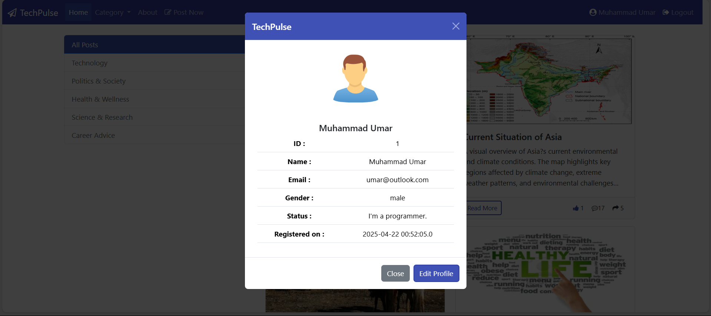

# TechPulse

**TechPulse** is a full-stack blogging web application that allows users to create, read, like, and manage blog posts in an organized and interactive environment. It includes features such as user authentication, category-based filtering, a personal dashboard, and profile management. The project is developed using Java Servlets and JSP for backend processing and frontend views. Styling and client-side interactivity are handled using CSS, Bootstrap, JavaScript, and AJAX.

## Features

- User registration and login system
- Create and publish blog posts
- Like and view posts in real time
- Filter posts based on selected categories
- Edit user profile information
- View personalized dashboard
- Interactive and responsive user interface
- Snapshots included for demonstration

## Technologies Used

### Frontend (View Layer)

- JSP (JavaServer Pages)
- CSS
- Bootstrap
- JavaScript
- AJAX

### Backend

- Java Servlets
- JSP (used as both view and logic layer)
- JDBC for database connectivity

### Database

- MySQL

## Snapshots

### Homepage  

### Login Page  

### Registration Page  

### Dashboard View  

### Category Filtering 

### Profile View  

### Profile Edit  

### Create Post  

### Post Page  
